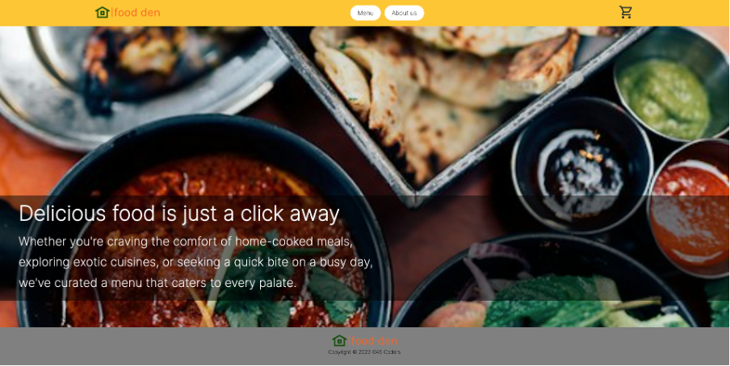
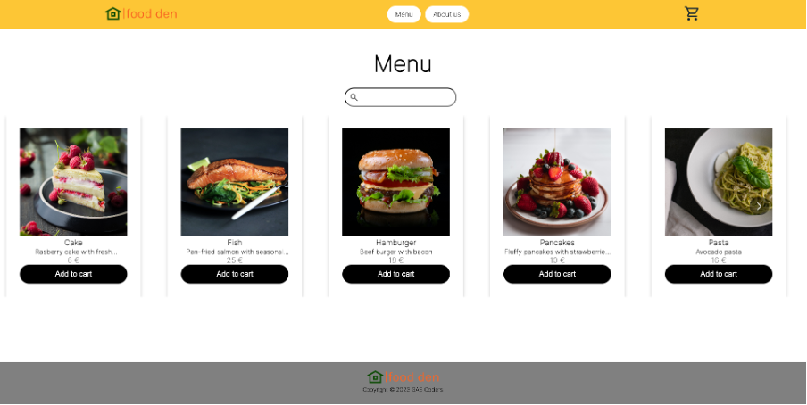
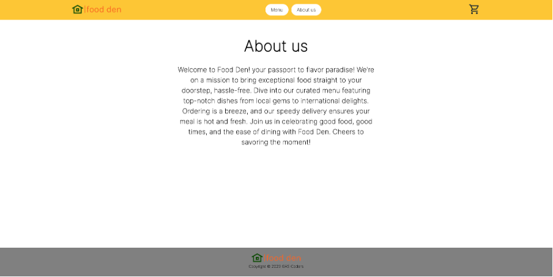
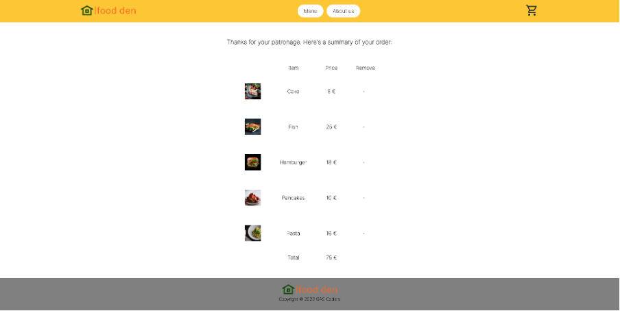

# Food Den

## Description

Food Den is a school project done on a course called Software Development Team Project 1 at Business College Helsinki.

## Technologies used

- React

## Live page link

## Visuals

Home page:

Menu page:

About us page:

Cart page:

## Authors

- Satu Halinen
- Mithun Munsi
- Anika Tahashin
- George Uzoh
